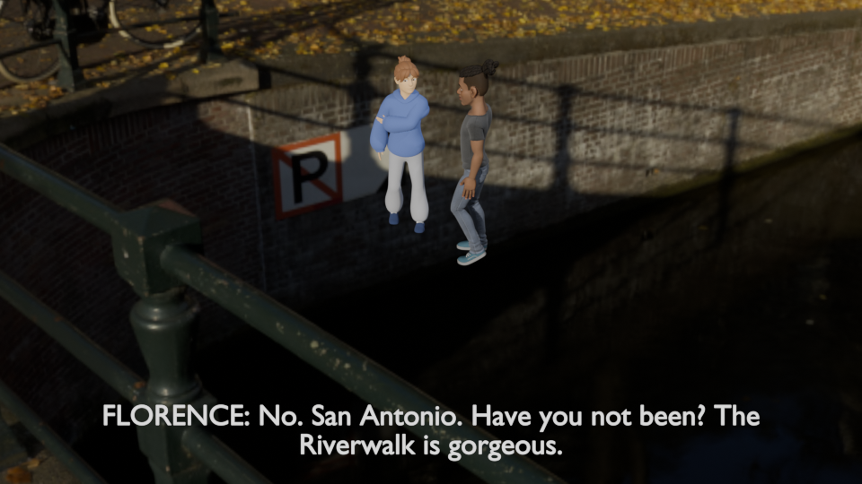

# Captions

A quick-and-dirty dialogue captions add-on for Blender, designed for animatic
workflows. One Text object displays every line; timing is keyframed and
draggable in the dopesheet. Fully scriptable via `bpy.ops` for headless / MCP /
AI-driven authoring.



## Why

Most animatic workflows route dialogue through the VSE or per-shot text
objects. Both pile up management overhead. This add-on collapses all dialogue
into one keyframed object: click it, see every line's start and end on the
timeline, drag to retime.

## Install

1. Grab [`dist/captions_tool-0.1.3.zip`](dist/captions_tool-0.1.3.zip) from this
   repo (also attached to the corresponding GitHub Release).
2. Blender → Edit → Preferences → Add-ons → Install... → pick the zip.
3. Enable "Animation: Captions".

If install fails with "already registered as a subclass" or similar, the
add-on is half-loaded from a previous attempt — run
[`scripts/cleanup.py`](scripts/cleanup.py) from the Text Editor first, then
try installing again.

To rebuild the zip after editing the source:

```powershell
Compress-Archive -Force -Path .\captions_tool -DestinationPath .\dist\captions_tool-0.1.3.zip
```

## Use

Open the N-panel in the 3D viewport and find the **Captions** tab.

- **Create Master Object** (shown until you add a line) creates the single
  Text object parented to the active camera at the bottom of frame.
- **+** adds a line. The current frame becomes the line's start; end is
  start + `default_duration` (48 frames).
- Edit text, start, end in the active line box. The `key` buttons set start
  or end to the current frame.
- Drag keyframes in the dopesheet to retime — the panel auto-syncs.

## Script it

```python
import bpy, json

dialogue = [
    {"text": "SEBASTIAN: Paris?",      "start": 1,   "end": 36},
    {"text": "FLORENCE: No. San Antonio. Have you not been? The Riverwalk is gorgeous.",
                                       "start": 50,  "end": 146},
    {"text": "SEBASTIAN: What's wrong?","start": 160, "end": 195},
]
bpy.ops.captions.bulk_import(json_data=json.dumps(dialogue))
```

One call creates the master object, loads all lines, and writes the timing
F-curve. Scrub the timeline.

### API reference

After enabling the add-on a `CAPTIONS_README` Text datablock contains the full
API. Or call `bpy.ops.captions.print_api()` to regenerate it.

Operators (all under `bpy.ops.captions.*`):

| Operator | Purpose |
|---|---|
| `create_master_object` | Idempotent. Creates the single text object. |
| `add_line(text, start, end)` | Add one line. `start=-1` uses current frame. |
| `bulk_import(json_data, append=False)` | JSON array of `{text, start, end}`. |
| `remove_line` | Remove the active line. |
| `set_active_frame(which='START' or 'END')` | Set active line's frame to current. |
| `clear_all` | Wipe all lines. |
| `print_api` | Write API docs to `bpy.data.texts["CAPTIONS_README"]`. |

## How it works (architecture)

- **One Text object** named `Captions`, parented to the active camera with
  text-box wrapping sized from the camera frustum.
- **One F-curve** on a custom `caption_idx` integer property, CONSTANT
  interpolation. Each line contributes one keyframe at its start with
  `value=line_id`; a `-1` sentinel marks each end where no other line takes
  over. Lines are addressed by stable id, not collection position, so reorder
  and delete don't disturb the F-curve.
- **`frame_change_pre` handler** reads the F-curve value at the current frame
  and writes `text.body = lines[id].text`.
- **`depsgraph_update_post` handler** back-syncs dopesheet drags into the
  PropertyGroup so the panel always matches what plays.

The `timeline.py` module is the only place that knows the encoding. Every
other module talks to it through `write`, `read`, `active_line_id`.

## Compatibility

- Blender 4.2+ (tested on 5.1).
- Render engines: EEVEE, EEVEE Next, Cycles (text is emissive, ignores
  shadows).

## License

MIT
